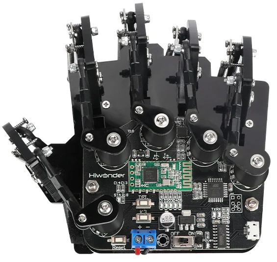

# SomaSoMouse
 Program and Arduino sketch which allows one to use a HiWonder Somatosensory Glove with their computer over BLE.
 
# Requirements
- Python 3.12.0+ (not tested on earlier versions)
  - see requirements.txt for required packages
- Arduino IDE 2.3.6+ (not tested on earlier versions)
- Arduino UNO
  - MPU6050 6-Axis MotionFusion Module
  - HC-08 Bluetooth Low Energy Module
  - 5 Potentiometers (Thumb, Pointer, Middle, Ring, Pinky)
- Bluetooth-compatible PC
  - A USB Dongle works here.
# Installation
1. Install Python 3.12.0 or later.
2. Install Arduino IDE 2.3.6 or later.
3. Clone this repo to an empty directory.
4. Open the new_hand directory in Arduino IDE, and flash new_hand.ino to your Glove.
5. Create a python virtual environment using requirements.txt
# Usage
1. Run SomaApp.py with Python to load the Kivy App
2. Turn on the Glove, and calibrate the fist and open hand values
3. Select Mode and Axes to track (Accerometer vs. Gyroscope, XY vs ZY vs ZX, Inversions)
4. Click "Connect Glove". The Glove should begin transmitting rotational and finger data at this point.